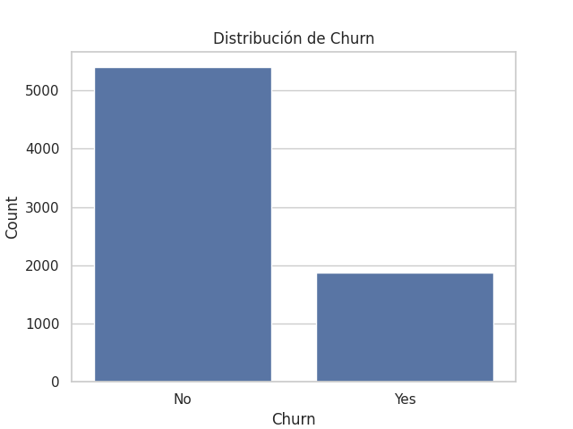
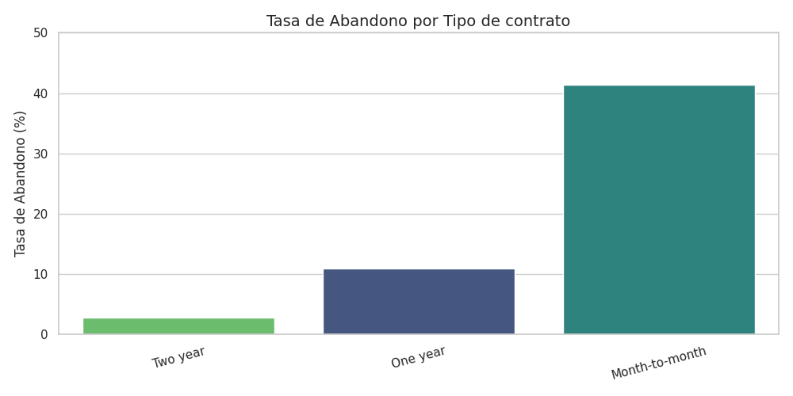
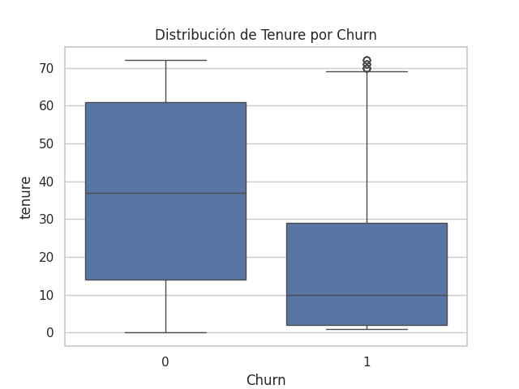

# 📞 Challenge Telecom X: Análisis de Evasión de Clientes

<div align="center">


</div>

## 🎯 Objetivo del Proyecto

Este proyecto analiza los factores que contribuyen a la **evasión de clientes (churn)** en Telecom X, una empresa de telecomunicaciones. El objetivo es identificar patrones y generar insights para desarrollar estrategias efectivas de retención de clientes.

## 📊 Dataset Overview

- **Registros**: 7,267 clientes
- **Variables**: 21 columnas (después de limpieza)
- **Tasa de Churn**: 25.72% 
- **Fuente**: JSON desde API REST

### Variables Principales:
- **Demográficas**: Gender, SeniorCitizen, Partner, Dependents
- **Servicios**: PhoneService, InternetService, OnlineSecurity, TechSupport
- **Contractuales**: Contract, PaymentMethod, PaperlessBilling
- **Financieras**: MonthlyCharges, TotalCharges, tenure

## 🔧 Metodología

### 1. ETL Pipeline
```python
# Extracción desde JSON
df = pd.read_json(url)

# Transformación con normalización anidada
df_customer = pd.json_normalize(df['customer'])
df_phone = pd.json_normalize(df['phone'])
df_internet = pd.json_normalize(df['internet'])
df_account = pd.json_normalize(df['account'])

# Carga consolidada
df = pd.concat([df_customer, df_phone, df_internet, df_account], axis=1)
```

### 2. Limpieza de Datos
- ✅ Tratamiento de valores vacíos en `Churn` (3.08% → 'No')
- ✅ Conversión de `TotalCharges` a numérico
- ✅ Mapeo de variables binarias (Yes/No → 1/0)
- ✅ Creación de variable derivada: `Cuentas_Diarias`

### 3. Análisis Exploratorio (EDA)
- Estadísticas descriptivas
- Distribuciones categóricas y numéricas
- Análisis de correlación con Churn
- Visualizaciones interactivas

## 📈 Principales Hallazgos

### 🔴 Factores de Alto Riesgo
| Factor | Impacto | Descripción |
|--------|---------|-------------|
| **Month-to-month Contract** | 🔥 Alto | 55.11% de clientes, mayor rotación |
| **Senior Citizens** | 🔥 Alto | 16.27% base, alta tasa evasión |
| **Fiber Optic** | 🔥 Alto | 44.01% clientes, churn elevado |
| **Electronic Check** | 🔥 Medio | 33.65% pagos, menos fidelización |

### 🟢 Factores Protectores
| Factor | Impacto | Descripción |
|--------|---------|-------------|
| **Two Year Contract** | 💚 Alto | Mayor estabilidad y fidelidad |
| **Dependientes** | 💚 Medio | 30.01% base, menor rotación |
| **Online Security** | 💚 Medio | 28.6% usuarios, mayor retención |
| **Tech Support** | 💚 Medio | 28.95% usuarios, menor churn |

## 📊 Visualizaciones Clave

<div align="center">

### Distribución de Churn


### Churn por Tipo de Contrato


### Tenure vs Churn


</div>

## 💡 Insights de Negocio

### 🎯 Métricas Clave
- **Churn Rate**: 25.72% (1,869 clientes perdidos)
- **Retención**: 74.28% (5,397 clientes activos)
- **Churn Diario**: ~2.47 clientes/día
- **Tenure Promedio (Churn)**: ~18 meses vs. ~38 meses (Activos)

### 📊 Patrones Identificados
1. **Contratos cortos** = Mayor riesgo de abandono
2. **Cargos mensuales altos** (>$70) correlacionan con churn
3. **Clientes nuevos** (<20 meses) requieren atención especial
4. **Servicios adicionales** actúan como "anclas" de retención

## 🚀 Recomendaciones Estratégicas

### 1. 📋 Retención Proactiva
- Incentivos para migrar a contratos anuales/bianuales
- Bundles atractivos con OnlineSecurity + TechSupport
- Programas de fidelización para clientes >12 meses

### 2. 🎯 Segmentación Inteligente
- Campañas personalizadas para Senior Citizens
- Onboarding reforzado para clientes nuevos (<6 meses)
- Ofertas especiales para usuarios Fiber Optic

### 3. 💳 Optimización de Pagos
- Promover métodos automáticos (Bank Transfer, Credit Card)
- Descuentos por cambio desde Electronic Check
- Alertas tempranas por problemas de pago

### 4. 📈 Monitoreo Continuo
- Dashboard en tiempo real con métricas de churn
- Alertas automáticas para clientes en riesgo
- KPIs de retención por segmento

## 🔮 Próximos Pasos

### Modelado Predictivo
```python
# Modelo de Machine Learning propuesto
from sklearn.ensemble import RandomForestClassifier
from sklearn.linear_model import LogisticRegression

# Features clave identificadas
key_features = ['tenure', 'MonthlyCharges', 'Contract', 
                'PaymentMethod', 'TotalCharges']
```

### Herramientas de BI
- **Tableau/Power BI**: Dashboards ejecutivos
- **Automated Reports**: Reportes semanales de churn
- **Predictive Scoring**: Sistema de puntuación de riesgo

## 🛠️ Tecnologías Utilizadas

```python
import pandas as pd           # Manipulación de datos
import numpy as np           # Cálculos numéricos
import matplotlib.pyplot as plt  # Visualizaciones base
import seaborn as sns        # Visualizaciones estadísticas
```

## 📊 Resultados de Negocio

### ROI Esperado
- **Reducción Churn**: -15% (objetivo 6 meses)
- **Aumento Retención**: +10% contratos anuales
- **Revenue Protection**: ~$2.3M anuales estimados

### Métricas de Éxito
- [ ] Churn rate < 20%
- [ ] Contratos anuales > 35%
- [ ] NPS score > 7.5
- [ ] Customer LTV +25%

---

*Proyecto desarrollado como parte del Challenge Data Science - Análisis de Churn en Telecomunicaciones* 🚀
